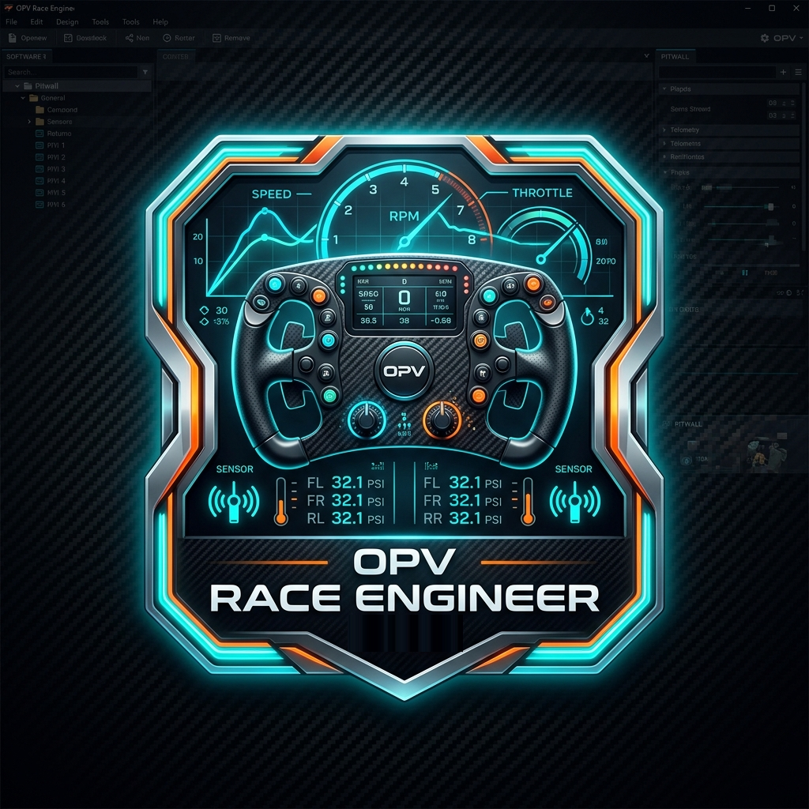

# 🏎️ OPV Race Engineer Pro

**OPV Race Engineer Pro** é o aplicativo oficial da **Liga OPV** para engenharia de pista, telemetria em tempo real e cálculo inteligente de estratégia para pilotos virtuais nos principais simuladores do automobilismo:

- 🏁 **Assetto Corsa EVO**
- 🏁 **Assetto Corsa Competizione (ACC)**
- 🏁 **Le Mans Ultimate (LMU)**

---

## 📥 Como Baixar e Usar (Download Oficial)

O aplicativo é distribuído em formato **Portable** (executável único, sem necessidade de instalação pesada ou dependências extras):

1. Acesse a seção de **[Releases Oficiais](https://github.com/ligaopv/OPVRaceEngineer/releases/latest)**.
2. Baixe o arquivo **`OPVRaceEngineer.exe`** (ou o pacote `.zip`).
3. Coloque o executável na pasta de sua preferência no seu computador.
4. Execute o **`OPVRaceEngineer.exe`** antes ou durante a abertura do seu simulador.
5. Pronto! O aplicativo detecta o simulador automaticamente e inicia a coleta de dados de telemetria.

> 💡 **Dica de Desempenho:** O aplicativo foi desenvolvido para rodar de forma ultraleve em segundo plano, sem causar oscilações de FPS ou frametimes no seu simulador.

---

## 🚀 Principais Recursos da Ferramenta

- ⏱️ **Cálculo de Combustível Inteligente:** Estimativa precisa de consumo médio por volta (L/v), monitoramento de combustível restante no tanque e cálculo exato de reabastecimento até a bandeirada final com voltas de segurança configuráveis.
- 🎯 **Delta de Pressão Alvo (PSI):** Cálculo dinâmico roda a roda (Dianteira Esquerda/Direita, Traseira Esquerda/Direita) para calibragem exata a frio, sugerindo o ajuste ideal após o stint.
- 🛑 **Pit Wall & Estratégia de Parada:** Regras interativas e intuitivas de troca de pneus (Obrigatório / Opcional / Não) e reabastecimento (Obrigatório / Programado / Livre / Não).
- 🔔 **Alerta Sonoro de Janela de Box:** Beep sonoro automático configurável nos minutos finais da janela de pit stop para você nunca perder a parada.
- 🌍 **Interface Multi-idiomas:** Suporte nativo a 7 idiomas com botão seletor de bandeiras:
  - 🇧🇷 Português (Brasil)
  - 🇵🇹 Português (Portugal)
  - 🇺🇸 English
  - 🇪🇸 Español
  - 🇮🇹 Italiano
  - 🇩🇪 Deutsch
  - 🇫🇷 Français
- ⚡ **Zero Impacto:** Desenvolvido nativamente em C# (.NET Framework nativo do Windows), sem instaladores invasivos.

---

## 🎁 Modelo Comunitário & Liga OPV

O **OPV Race Engineer Pro** é um projeto disponibilizado para a comunidade de pilotos virtuais:

- 📺 **YouTube:** [@ligaopv](https://www.youtube.com/@ligaopv)
- 📸 **Instagram:** [@ligaopv](https://www.instagram.com/ligaopv)
- 🏁 **The SimGrid:** [Comunidade Oficial da Liga OPV](https://www.thesimgrid.com/communities/liga-opv-oficina-piloto-virtual)
- 🌐 **Portal Oficial:** [ligaopv.com.br](https://ligaopv.com.br/)
- ✉️ **Suporte / Dúvidas:** contato@ligaopv.com.br

---

## ⚖️ Termos de Uso e Licença

Distribuído sob licença de uso comunitário pela **Liga OPV**. Todos os direitos reservados sobre o software e código-fonte proprietário.
